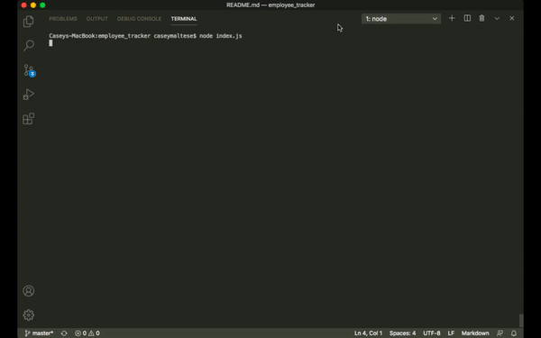

# employee_tracker

This app is a Content Management System intended for use by business owners to organize and maintain information about their employees. This is a command-line application that uses node, inquirer, and MySQL. For this project I used MySQL to create a database of employees containing three tables.  The business owner can view all of their employees and also view the employees using more specific criteria, such as by department and by manager.  Departments and roles within the company can be viewed and new departments and roles can be added.  The user can also add and remove employees, update a specific employee's role, and can update specific  employee's manager. 

## GIF of employee_tracker 

